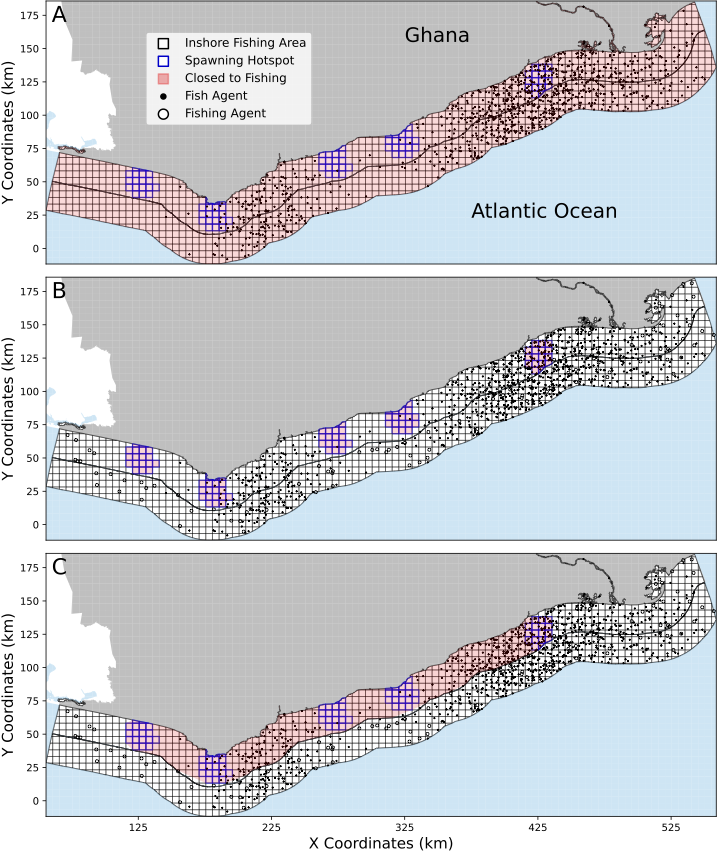

# *Agent-Based Model to Investigate the Effects of Configuration, Timing, and Duration of Closed Fishing Areas on the Ecologic and Economic Sustainability of the Artisanal Sardinella Fishery in Ghana.*

## Purpose 
A prototype spatially explicit Agent-Based Model (ABM) that captures the main characteristics of an idealized artisanal fishery to the specific Ghanaian sardinella case. I plan to adapt this model to investigate the combined effects of different sardinella management policies based on different designs of closing, including (1) spatial configurations (closure of whole fishing ground versus closure of spawning hotspots), (2) timing, and (3) duration. More specifically, I will use the model as a virtual laboratory to determine the policy (in terms of configuration, timing, and duration) that can optimize, simultaneously ecological and socioeconomic needs. 
		

   
          
      <em>  Simulated inshore fishing area reflecting different configurations of closed fishing areas. Closure of the whole Inshore Fishing Area (A). Closure of the individual sardinella spawning hotspots (B), and closure covering an area comprising all sardinella spawning hotspots and less extended than the whole IFA (C).  </em>   

## Note
Closed_Fishing_Areas.py contains the model code and is the main script to run. It is implemented in python. It will generate three outputs named **final_pirogue_geodata.csv**, **updated_mpa_sim_data.csv**, and **updated_mpa_sim_movie.mp4** in your working directory containing data on catch/fish abundance dynamics of individual pirogues, aggregated data on catch/fish abundance dynamics, and video of the simulation (as well as snapshots of each computing time step of the simulation).

## Team

Prof. Dr. Agostino Merico \
Leibniz Centre for Tropical Marine Research \
Constructor University Bremen \
Fahrenheitstr. 8, 28359, Bremen, Germany   
agostino.merico@leibniz-zmt.de

Dr. Kwabena Afriyie, Owusu \
University of Energy and Natural Resources (UENR) \
Post Office Box 214, Sunyani Ghana, West Africa        
kwabena@aims.edu.gh 
	

